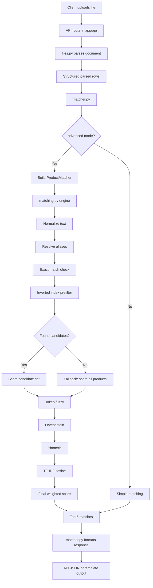

# ShipsKart Parser OG

A FastAPI-based parser and product-matching system for procurement documents.  
It reads uploaded files, extracts structured item rows, and matches each item against the ShipsKart product catalog using either a simple fuzzy matcher or an advanced layered matcher.

---

## What this project does

This project solves two problems:

1. **Document parsing**
   - Reads Excel, PDF, and Word files
   - Detects useful headers even if they are messy or unusual
   - Extracts rows like item name, quantity, UOM, remarks, and other fields

2. **Product matching**
   - Takes each parsed item
   - Compares it against the ShipsKart catalog
   - Returns top candidate products with scores

---

## Logic location map

This section tells you exactly **where each type of logic belongs**.

### High-level responsibility split

| Location | Responsibility | What logic belongs here |
|---|---|---|
| `app/main.py` | App entrypoint | FastAPI app creation, router registration, startup wiring |
| `app/api/` | API layer | Routes, request handling, file upload input, query params, response return |
| `app/services/files.py` | Parsing layer | File reading, file-type detection, extraction of structured tables/rows |
| `app/services/matcher.py` | Orchestration layer | Chooses simple vs advanced matching, builds matcher, formats final results |
| `app/services/matching.py` | Matching engine | Normalization, aliases, typo scoring, phonetic scoring, TF-IDF, ranking |
| `app/models/` | Database models | SQLAlchemy table definitions like Product, Brand, Category |
| `app/schemas/` | API contracts | Pydantic request/response models |
| `app/db/` | Database setup | Engine, session, DB dependency injection |
| `app/templates/` | Frontend rendering | HTML/Jinja pages for showing match results and candidate options |
| `requirements.txt` | Dependencies | Python packages needed to run the project |

---

## Exact file-level logic

### `app/main.py`
This is the project boot file.

**Put here:**
- `FastAPI()` app creation
- middleware registration
- router inclusion
- startup setup

**Do not put here:**
- parsing logic
- matching logic
- database query business rules

Think of this file as the **entry gate** only.

---

### `app/api/`
This is the **HTTP layer**.

**Put here:**
- route definitions like `POST /parse/match`
- uploaded file reading from request
- query params such as:
  - `advanced=true`
  - `use_levenshtein=true`
  - `use_tfidf=true`
  - `use_inverted_index=true`
  - `use_phonetic=true`
- calling service functions
- returning JSON or template responses

**Do not put here:**
- fuzzy score formulas
- alias resolution rules
- TF-IDF building
- heavy business logic

Think of `api/` as the **controller layer**.

---

### `app/services/files.py`
This is the **document parsing logic layer**.

**Put here:**
- file type detection
- Excel sheet reading
- PDF table/text extraction
- Word document extraction
- header cleaning
- row extraction
- raw table-to-structured-data conversion

**Example responsibilities:**
- find the header row even if it is not row 1
- normalize weird headers like `Qty Req`, `Product name`, `Purchase Reamrk`
- convert rows into a standard internal format such as:
  - `items`
  - `quantity`
  - `unit_of_measurement`
  - `purchase_remark`

Think of this file as the **document reader and cleaner**.

---

### `app/services/matcher.py`
This is the **matching orchestration file**.

It does not contain the deepest scoring logic.  
Instead, it **coordinates** the matching workflow.

**Put here:**
- simple matching wrapper
- advanced matching wrapper
- database product loading
- converting DB products to matcher objects
- calling `ProductMatcher`
- formatting top matches into API-friendly dictionaries
- summary counts like matched/unmatched totals

**Important functions that belong here:**
- `match_item_simple()`
- `match_document_simple()`
- `_build_product_matcher()`
- `match_item_advanced()`
- `match_document_advanced()`
- `match_document()`

Think of this file as the **traffic controller** between:
- parsed rows,
- database products,
- matching engine,
- final API response.

---

### `app/services/matching.py`
This is the **real matching engine**.

This file contains the algorithm itself.

**Put here:**
- text normalization
- alias expansion
- candidate filtering
- fuzzy scoring
- Levenshtein scoring
- phonetic scoring
- TF-IDF scoring
- top-N ranking
- threshold decisions

**Important logic in this file:**

#### 1. Normalization
Converts text into a cleaner form:
- lowercase
- punctuation removed
- spaces normalized

Example:
- `Chicken - Dressed Broiler`
- becomes
- `chicken dressed broiler`

#### 2. Alias resolution
Maps regional names to standard names.

Examples:
- `baingan -> egg plant`
- `tamatar -> tomatoes`
- `murg -> chicken`

#### 3. Exact match
If the cleaned query exactly matches a product name, return immediately.

#### 4. Inverted index
Used for fast candidate prefiltering.

Example:
- query contains `chicken`
- fetch all products containing `chicken`
- score only that smaller list

#### 5. Typo fallback
If the inverted index finds no candidates because the words are heavily misspelled, the system falls back to scoring **all products**.

This is what helps cases like:
- `chiken dressed broylr`

#### 6. Token fuzzy score
Uses RapidFuzz token logic to handle:
- word order changes
- partial overlaps
- token similarity

#### 7. Levenshtein score
Handles character typos.

Examples:
- `chiken` vs `chicken`
- `broylr` vs `broiler`

#### 8. Phonetic score
Uses `jellyfish.soundex()` to compare words that sound similar even when spelled differently.

This helps for words that are typed "how they sound".

#### 9. TF-IDF cosine similarity
Builds character n-gram vectors and compares them mathematically.

This helps when:
- there are multiple typos
- word shapes are still similar
- token overlap is weak

#### 10. Final weighted score
Blends token score, Levenshtein, phonetic, and TF-IDF into one final score.

#### 11. Match status
Returns status like:
- `confident`
- `candidate`
- `no_match`

Think of `matching.py` as the **brain of the project**.

---

### `app/models/`
This contains the **database truth**.

**Put here:**
- SQLAlchemy models
- table column definitions
- foreign keys
- relationships

Example:
- `Product`
- `Brand`
- `Category`

This layer should define what the data **is**, not how matching works.

---

### `app/schemas/`
This contains the **request/response shapes**.

**Put here:**
- Pydantic models for API input/output
- validation rules
- response formatting contracts

This helps keep your API responses predictable and clean.

---

### `app/db/`
This contains the **database connection plumbing**.

**Put here:**
- SQLAlchemy engine
- sessionmaker
- `get_db()` dependency
- connection setup

This file should not contain matching logic or parsing logic.

---

### `app/templates/`
This contains the **HTML presentation layer** if you are rendering a frontend page.

**Put here:**
- results page
- candidate list UI
- best match card
- interactive selection UI

If the app returns pure JSON only, this layer becomes less important.  
If the app shows browser pages, this is where UI logic belongs.

---

## Folder structure

```text
ShipsKart-Parser-OG/
├── app/
│   ├── api/                  # route handlers / endpoints
│   ├── core/                 # config and shared app settings
│   ├── db/                   # database engine and sessions
│   ├── models/               # SQLAlchemy models
│   ├── schemas/              # Pydantic schemas
│   ├── services/
│   │   ├── files.py          # file parsing logic
│   │   ├── matcher.py        # matching orchestrator
│   │   └── matching.py       # core matching engine
│   ├── templates/            # HTML/Jinja result UI
│   └── main.py               # FastAPI entrypoint
├── requirements.txt
└── README.md
```

---

## End-to-end flow



---

## Where to edit when you want a specific change

### If you want to improve parsing
Edit:
- `app/services/files.py`

Examples:
- better header detection
- better quantity/UOM detection
- better row extraction from Excel/PDF/Word

### If you want to improve typo handling
Edit:
- `app/services/matching.py`

Examples:
- stronger Levenshtein weight
- phonetic tuning
- TF-IDF weighting
- fallback behavior
- thresholds

### If you want to change simple vs advanced flow
Edit:
- `app/services/matcher.py`

Examples:
- defaulting to advanced mode
- changing top N from 5 to 10
- changing summary counters
- formatting extra response fields

### If you want to change API request behavior
Edit:
- `app/api/`

Examples:
- add a new query param
- change response format

### If you want to change what user sees on page
Edit:
- `app/templates/`

Examples:
- make all 5 options clickable
- show confidence badges
- add confirm button
- improve result cards

---

## Matching stack summary

The advanced matcher includes:

1. Normalization
2. Alias resolution
3. Token fuzzy matching
4. Levenshtein similarity
5. Phonetic similarity
6. TF-IDF similarity
7. Inverted index prefilter
8. Typo fallback to all products

This means the project is designed so that:
- **parsing logic** is separate,
- **orchestration logic** is separate,
- **matching intelligence** is separate,
- **database structure** is separate,
- **UI rendering** is separate.

That separation makes debugging much easier.

---

## Installation

```bash
git clone https://github.com/Dwaynee247-06/ShipsKart-Parser-OG.git
cd ShipsKart-Parser-OG
pip install -r requirements.txt
```

---

## Run locally

```bash
uvicorn app.main:app --reload


front end(flask)
cd flask_ui
pip install flask requests
python app.py
```

Swagger docs:

```bash
http://127.0.0.1:8080/docs
```

---

## Important dependencies

```txt
fastapi>=0.115.0
uvicorn[standard]>=0.30.0
python-multipart>=0.0.9
openpyxl>=3.1.0
python-docx>=1.1.0
pdfplumber>=0.11.0
orjson>=3.10.0
pydantic>=2.7.0
pydantic-settings>=2.3.0
sqlalchemy>=2.0.0
pyodbc>=5.1.0
alembic>=1.13.0
rapidfuzz>=3.9.0
jellyfish>=1.0.0
scikit-learn>=1.4.0
pytest>=8.0.0
httpx>=0.27.0
```

All dependencies listed above are required. Install them all with `pip install -r requirements.txt`.

---

## Current matching notes

The advanced matcher includes:
- typo fallback when inverted-index search returns nothing,
- phonetic matching using `jellyfish`,
- adaptive weighted scoring,
- lower confidence threshold for typo-heavy real-world inputs,
- reliable top 5 candidate results per row.

---

## Author

Built for ShipsKart document parsing and smart catalog matching workflows.
